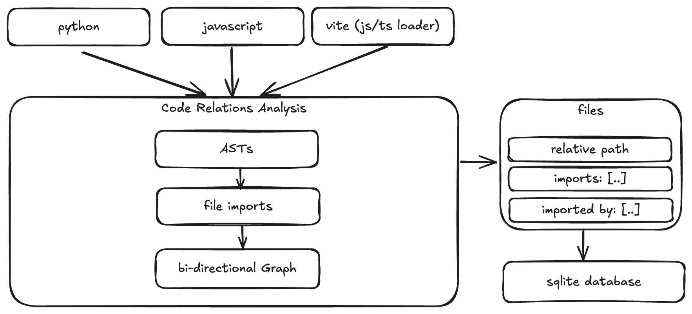
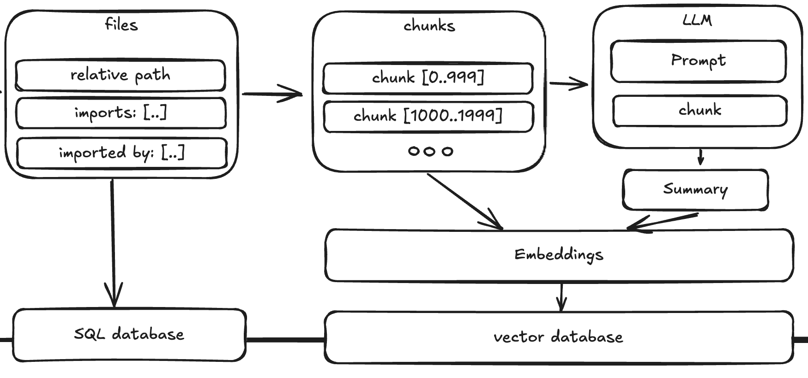
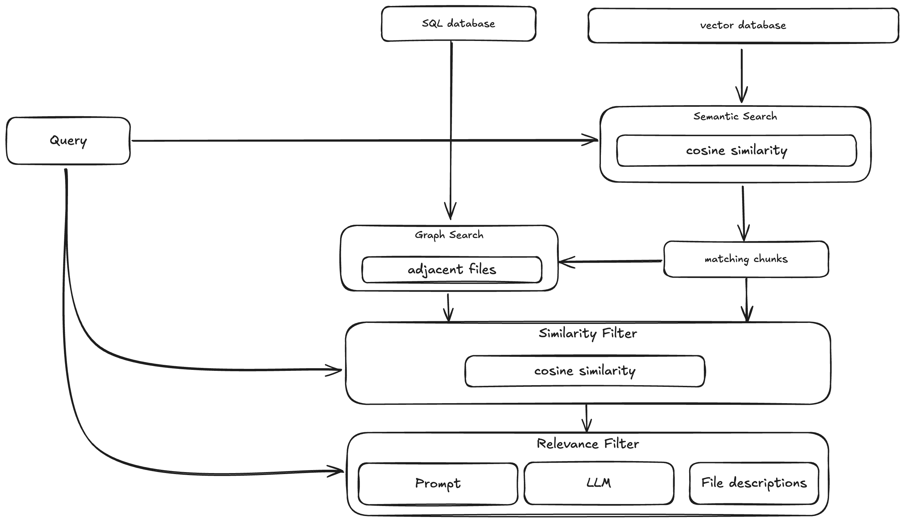
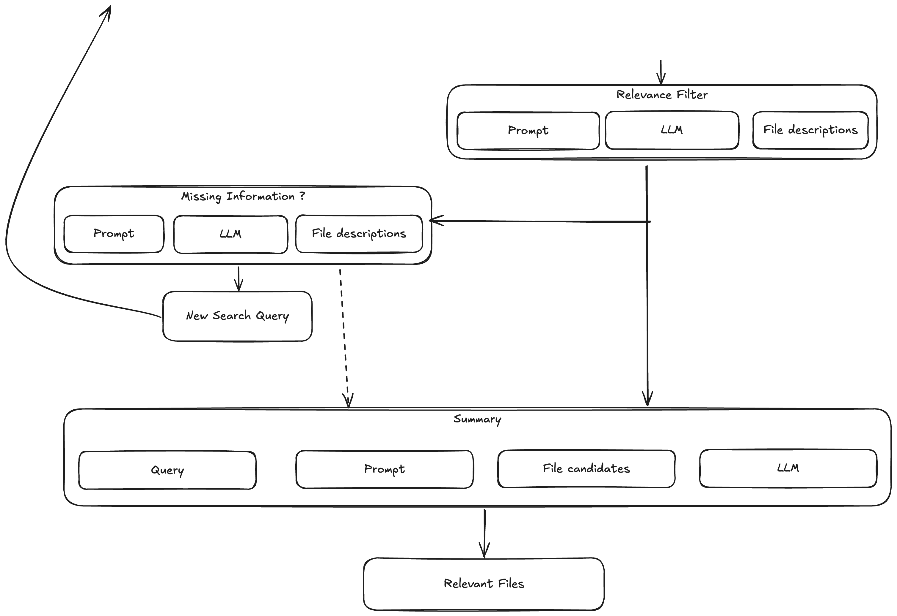
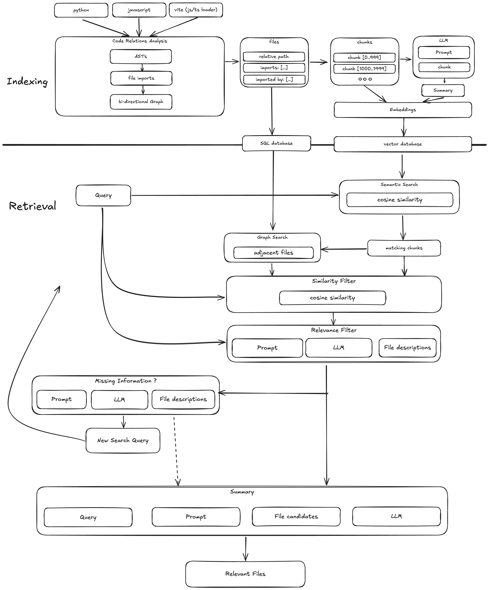

**Advanced Report on the Retrieval-Augmented Generation (RAG) System for Code Analysis**

## 1. Introduction

This document outlines a sophisticated **Retrieval-Augmented Generation (RAG) system** designed to facilitate **comprehensive indexing, categorization, and retrieval** of relevant files within software repositories. The system integrates **vector databases** with **Large Language Models (LLMs)** to enhance semantic search capabilities, enabling **context-aware file retrieval** within complex codebases. Its primary objective is to augment software development workflows by providing intelligent, automated file discovery based on functional relevance and dependency analysis.

The system architecture is structured into the following sequential pipeline stages:

- **Code Analysis**: Extracts interdependencies and constructs an import graph.
- **Summarization**: Generates concise representations of file contents.
- **Vectorization**: Embeds summaries and full content for similarity search.
- **Retrieval & Filtering**: Identifies relevant files based on user-defined requirements.

This framework is designed for **command-line execution**, ensuring efficient file retrieval tailored to a given query while maintaining modularity for adaptability across various projects.
---

## 2. System Architecture and Code Structure

The system adheres to a **modular and extensible architecture**, ensuring maintainability and scalability. The core components include:

### 2.1 Code Analysis Module

This module analyzes the relationships between files building a structured representation that captures interdependencies.

**Challenges in Static Import Analysis**

Static import analysis is complicated by language-specific behaviors and project configurations. Python allows dynamic imports, making static resolution difficult, while JavaScript's module system varies depending on bundlers and frameworks. These differences require tailored parsing strategies to extract meaningful dependencies.

Additionally, modern software projects frequently employ unconventional import mechanisms such as monorepos, symlinked dependencies, and runtime-specific loaders. These introduce complexity, making it difficult to construct accurate dependency graphs using purely static analysis techniques.

**Implementation**:

- Utilizes **tree-sitter** to construct **Abstract Syntax Trees (ASTs)** for precise parsing.
- Builds a **directed acyclic graph** (DAG) representing file interdependencies.
- Supports **Python, JavaScript, and Vite-based projects**, leveraging Vite’s dynamic import resolution.
- Stores results in **SQLite**, ensuring structured and efficient access to dependency data.



### 2.2 Summarization Module

To enable efficient and precise retrieval, this module generates concise yet comprehensive summaries of source files. These summaries help in determining a file’s relevance to specific requirements without needing to analyze the full code.

**Implementation**

- Extracts file contents and, for large files (>100,000 characters), segments them into **1,000-character chunks**.
- Applies **adaptive prompting techniques** for chunked and non-chunked files.
  - If a file is small enough, it is summarized as a whole using a direct summarization prompt.
  - For files exceeding 100,000 characters, the content is divided into 1,000-character chunks, with each chunk being summarized independently.
  - Once all chunks are summarized, the system consolidates the results using the following prompt:
- Persists summaries and associated metadata in **ChromaDB**.

**Summaries**

Summaries are generated using the following LLM prompts**:

> _You are an expert software engineer who has been asked to generate a summary of a code file. The summary should not only contain information about the code, but also what it is used for, its purpose, including keywords at the end. Be as concise as possible and do not repeat yourself._

> _A chunk of the file content is as follows: {file_content}_

> _Summaries of chunks of the file: {file_content}_

> _Given a Python file, generate a summary of this file to map a given use case requirement to the given Python code. The summary should capture the purpose of this file such that given a use case requirement, it can be determined if this class is relevant._

### 2.3 Vectorization Module

Once the files are analyzed and summarized, this module translates them into a high-dimensional vector space, allowing for rapid similarity-based retrieval. By embedding both summaries and full contents, the system ensures that searches yield contextually relevant results.

**Implementation**:

- Utilizes **LLM-generated embeddings** for both summaries and full file contents.
- Separates embeddings into **two distinct ChromaDB vector stores** to facilitate multi-layered retrieval.
- Structures vector indices to maximize retrieval efficiency via cosine similarity calculations.



### 2.4 Retrieval & Query Processing Module

This module orchestrates the final step in the retrieval process, transforming user queries into structured searches. By leveraging vectorized data and dependency graphs, it refines results to ensure that only the most pertinent files are returned.

**Implementation**:

- Reformulates user queries to align with vector database search paradigms.
- Executes **semantic similarity matching** using embedding-based retrieval.
- Expands the retrieval scope by incorporating **adjacent files** within the dependency graph.
- Their summaries are analyzed to determine how closely they align with the original query.
- The LLM receives a structured prompt where it is given:
  - The original user query (requirement).
  - A list of similar files along with their summaries.
  - The prompt explicitly instructs the LLM to remove files that are not relevant and avoid hallucinating new files.


- Identifies **missing but necessary files** to enhance coverage for the requirement with the following prompt
  > You are given a requirement for a software project and a list of files with their summaries that are similar to the requirement.
    Which other files are still needed to fulfill the requirement?
    Generate a string that can be used to search a vector database for files that are missing.
    This vector database contains embeddings of summaries and contents of the files in the project.
    Return ONLY the string for the search.
    
    > Requirement:
    > {requirement}
    
    >Similar files:
    >{files}



- All relevant infromation is being processed by another query to an LLM: The LLM’s output is expected in a strict JSON format, listing only the files that remain relevant. The system then parses this output and updates the list of files for the next processing step. The following prompt is used:
  > You are given a requirement for a software project and a list of files with their summaries that are similar to the requirement.
  
  > A user needs to implement this requirement and through preprocessing we selected a list of files that could be relevant.
  
  >  Please provide a summary in the following format to the user:

  > **Summary**
  
  >  *Summary text for the changes to be performed*

  > **Step-by-Step Breakdown**
  
  > *Step-by-step breakdown of the changes to be performed*
    *Structure the steps by components, so the user knows which need to be changed*
    
  > *Example*
  
  >   a. Image component
  
  >    - Change the image source to the new image
  
  >   b. Backend
  
  >   - Add a new endpoint for the new feature
  
  > *End of example*

  >Do not give or generate code samples!

  >Do not hallucinate steps that are not related to the relevant files!
  
  >Be very concise in the steps!
  
  > Do not make up steps that are unrelated to the given files!

  > **Files to be changed**
  
  > *List of files that need to be changed in a markdown list*
  > *Do not give additional files that are not related to the requirement or hallucinate files*
  > *Only write file names that were given before*

  > **Estimation**
  
  > *Estimation of the time needed to implement the changes*
  
  >*First write a one-sentence summary of the estimation*
  
  >*Then write: Estimation: X hours*

  > Requirement:
  {requirement}

  > Similar files:
  {files}


---

## 3. LLM Integration Across System Processes

The system leverages **LLM-based processing** at multiple decision points to improve retrieval accuracy:

1. **Query Reformulation**: Restructuring user queries for optimal semantic search performance.
2. **Summarization & Abstraction**: Extracting key functionality from code components.
3. **Post-Retrieval Filtering**: Refining results by eliminating non-relevant matches.
4. **Implementation Roadmap Generation**: Providing a structured breakdown of necessary modifications.

The integration of LLMs ensures **context-aware file retrieval**, surpassing traditional **keyword-matching approaches** by embedding files in a **semantic space** that better aligns with software development needs.


---

## 4. User Interaction and Functional Capabilities

The system is designed for CLI-based execution, allowing users to interact with the platform via configurable commands. To initialize a project and analyze its directory, summarize file contents, and vectorize both summaries and full content for retrieval, use:

```sh
python script.py <project_name> init --analyse --summarize --vectorize-summaries --vectorize-content
```

To retrieve files relevant to a specific requirement, execute:

```sh
python script.py <project_name> retrieve --query "Implement OAuth authentication"
```

This searches the indexed database and returns semantically similar files.

To expand the query scope by including files adjacent in the project’s dependency structure, use:

```sh
python script.py <project_name> retrieve --query "Enhance API security" --adjacent
```

This ensures the retrieval of directly related files.

To identify additional files required to fulfill a requirement, execute:

```sh
python script.py <project_name> retrieve --query "Refactor database layer" --find-missing
```

This helps uncover dependencies that might otherwise be overlooked.

To generate a structured implementation roadmap detailing required modifications, use:

```sh
python script.py <project_name> retrieve --query "Upgrade frontend design" --summary
```

This provides a high-level overview of necessary changes, including step-by-step instructions, affected components, and estimated effort.&#x20;

---

## 5. Strengths and Technical Considerations

### Advantages

✔ **Semantic Search Optimization**: Embedding-based retrieval improves **contextual understanding** beyond traditional search methods.
✔ **Dependency-Aware Retrieval**: Ensures inclusion of structurally relevant files.
✔ **LLM-Augmented Filtering**: Reduces false positives, enhancing precision.
✔ **Structured Implementation Guidance**: Provides actionable insights into code modification.
✔ **Scalability**: Modular design allows extension to additional languages and architectures.

---

## 6. Conclusion

This **Retrieval-Augmented Generation (RAG) system** significantly advances code analysis workflows by integrating **vector search and LLM-driven reasoning**. Future developments may include **incremental indexing, support for additional programming languages, and GUI-based interaction models** to expand usability in complex software engineering environments.
